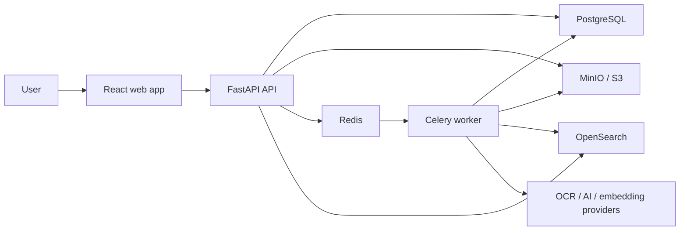

# Architecture

## System Context

PaperVault keeps document binaries in S3-compatible object storage and stores metadata, users, processing state, timelines, tags, notifications, and search history in PostgreSQL. OpenSearch is a rebuildable query projection. Redis transports background jobs to Celery workers.

PostgreSQL and object storage are authoritative. OpenSearch can be rebuilt from those sources and is never the only copy of document metadata or extracted text.

## Code Boundaries

The backend is a modular monolith organized by feature:

- `documents`: uploads, extraction, processing, metadata, versions, viewer data, retry, archive, and duplicate resolution.
- `identity`: local authentication, OIDC, JWTs, RBAC, and user management.
- `administration`: persisted instance policy and runtime administration views.
- `search`: database and OpenSearch query/index adapters plus search history.
- `questions`: tenant-scoped chunk retrieval, grounded answer policy, citations, and refusal behavior.
- `collections`: manual membership and dynamically evaluated document views.
- `tags`: tag ownership and document assignment.
- `notifications`: reminder projection and user status.
- `timeline`: append-only document activity.
- `core`: configuration, logging, health, and observability.

HTTP routes validate transport data and call application services. Celery tasks compose provider adapters and use cases. Business rules do not belong in route handlers or task functions.

The frontend follows the same feature-first approach:

- `app`: providers and routing.
- `features`: documents, questions, administration, collections, tags, duplicates, notifications, and shell workflows.
- `components/ui`: shared interaction primitives.
- `lib`: typed API client, configuration, and small utilities.

## Upload And Processing

Processing state is committed before expensive work starts. Expected extraction failures and unexpected worker failures end in a visible `failed` state with a user-safe diagnostic. Failed and stale queued documents can be re-enqueued without re-uploading the source file. Archive is terminal and cannot be overwritten by a late worker.

## Extraction And Intelligence

The extraction interface supports embedded PDF text and OCR adapters. The default composite implementation tries embedded text first and uses Poppler plus Tesseract when the PDF has no usable text. Extracted text is normalized at the persistence boundary so provider-specific control characters cannot invalidate a PostgreSQL transaction.

Page text is stored as immutable children of each extraction. Flattened text remains available for summaries, metadata extraction, embeddings, and global search.

Tesseract OCR also stores normalized word coordinates and confidence values. Coordinates are independent of source resolution, so the viewer can draw search highlights over responsive PDF and image previews without storing rendered pages.

Document-specific metadata schemas live in the document-type registry. Provider output passes through a shared normalization boundary for locale-aware dates, currencies, numbers, booleans, and structured table rows. Missing required fields, invalid values, low classification confidence, and unresolved generic classifications place the document in an owner-scoped review queue.

AI analysis and embeddings use provider interfaces. The default local providers are deterministic and require no external service. Local classification requires distinctive document signals rather than isolated words, and its summaries are assembled from classified type, extracted fields, amounts, and dates. Ollama and OpenAI-compatible adapters implement the same contracts and are preferred for richer free-form synthesis. Model output is parsed as structured JSON, categories are checked against the document-type registry, confidence is bounded, and embedding dimensions are validated before persistence.

High-confidence suggested tags are normalized and attached automatically with an `ai`
source and confidence score. Existing manual tag links take precedence. Classification
and tag changes remain searchable through the eventual OpenSearch projection.

Smart tags use the same owned-document rule vocabulary as dynamic collections. Rules
can match document types, dates, title, issuer, and organization. They are deterministic,
cannot depend on another tag, and materialize ordinary document-tag links so search and
the rest of the application do not need a second tag model. A full refresh reconciles
an existing vault, while normal processing and document edits synchronize only the
affected document. Manual and AI assignments are not removed by smart-rule refreshes.

## Grounded Questions

Question answering is separate from document search. Search returns ranked documents; the question service retrieves page-bound chunks from ready documents owned by the caller and asks a grounded-answer provider to answer only from that evidence. Retrieval requires minimum concept coverage and boosts the requested document family and chunks containing answer-shaped values.

Chunks and their embeddings are materialized during normal AI processing. The question service lazily backfills chunks for older current extractions, which avoids a blocking data migration. The local answer provider extracts common salary amounts, purchase/due/expiry dates, and document lists from labeled evidence. For other supported evidence it returns a clearly labeled relevant passage, and it refuses when too few question concepts match. Ollama and OpenAI-compatible answer providers receive only retrieved evidence and must return concise answers with valid citation indexes or refuse. The service validates those indexes and preserves the same citation contract for every provider.

The database is the chunk source of truth. Retrieval is currently bounded to 5,000 owned chunks per request; a dedicated OpenSearch chunk projection is the scaling path for larger vaults. Every answer provider preserves the same citation and refusal contract.

## Search

The worker projects owned document fields, current text, AI output, metadata, tags, and embeddings into OpenSearch. Keyword, semantic, and hybrid queries use OpenSearch when enabled. A PostgreSQL scorer remains available as a controlled fallback.

Lifecycle and tag changes commit to PostgreSQL first and then refresh the search projection on a best-effort basis. Indexing failure is observable but does not roll back a successful metadata edit.

## Collections And Organization

Collections are user-owned views over the document library. A manual collection stores
only membership links; it never copies or moves the source object. A dynamic collection
stores a typed rule and evaluates current PostgreSQL document state when it is opened,
so membership cannot become stale. Conditions are combined with AND, while multiple
values within one condition use OR.

Dynamic collections can use existing tag slugs as a condition. Smart tags deliberately
cannot use tags as input because recursive tag rules would introduce cycles and
non-deterministic update order. Archived documents are excluded unless a dynamic
collection explicitly includes them. Collection create, edit, delete, add, and remove
actions are recorded in the vault timeline.

## Document Lifecycle

- Source binaries are not stored in PostgreSQL.
- Source replacement creates an immutable source version, clears stale derived projections, and queues normal processing.
- Restoring an earlier source creates a new current version that references the retained immutable object; history is never rewritten.
- Text extractions retain source-version lineage, enabling owner-scoped extracted-text comparison between versions.
- Archive hides documents from normal lists, duplicate candidates, notifications, and search without deleting source data.
- Permanent deletion is owner-scoped and removes source/version objects, the PostgreSQL document graph, and the rebuildable search projection.
- Duplicate fingerprints are generated from the current successful text extraction during worker processing. Normalized-text hashes detect identical extracted content, while deterministic MinHash signatures and indexed locality-sensitive bands produce bounded content/OCR similarity candidates without comparing every document pair.
- Duplicate results carry their method, confidence, text/length similarity, and a plain-language explanation. Exact-file matches can be resolved directly; every non-exact match requires user confirmation and fresh server-side fingerprint validation before redundant documents are archived.
- Timeline events capture uploads, metadata edits, tag and collection changes, source versions, archives, and related lifecycle actions. An owner-scoped vault feed provides a cross-document view.

## Identity And Administration

Local passwords use PBKDF2-SHA256 with per-password salts. JWT access tokens carry issuer, audience, expiry, subject, email, and role claims; each request also checks the current database user state. OIDC uses provider discovery, authorization code exchange, signed callback state, nonce verification, and JWKS-backed ID token validation.

The first account becomes an administrator. Administrators can manage users, permanently delete non-current accounts and their owned source objects, and override the local-registration policy at runtime. Self-deletion and deletion of the last active administrator are refused. The environment value remains the bootstrap default until a persisted instance setting is saved. Provider names and operational capability flags are visible to administrators, while secrets remain environment or secret-store configuration.

## Viewer And UI

The PDF viewer is loaded only when a preview opens. PDF.js renders one responsive page at a time with zoom, page navigation, a text layer, and highlighted literal matches. OCR-only documents use stored word geometry to highlight matching text over the rendered PDF or image. Highlights are fetched only for the active page and explicit query.

The application opens on a vault dashboard. A full-width, Drive-style document library remains usable as collections grow. Collections provide a compact rail, grid/list document views, dynamic rules, and an integrated tag workspace without adding another top-level navigation item. Opening a document removes the global search surface and presents focused Overview, Details, Activity, and Versions tabs. Ask uses a conversation layout with a persistent composer and compact citations. Low-confidence documents have a dedicated review queue plus a compact approval action. Secondary editors, raw metadata, filters, and search history appear only when requested. Settings and provider health are visible only to administrators. Light and dark themes share the same semantic design tokens.

## Observability

- Structured application and worker logs.
- Prometheus metrics at `/metrics`.
- OpenTelemetry tracing when an OTLP endpoint is configured.
- Liveness and database-backed readiness endpoints for orchestration.
- User-safe processing diagnostics in PostgreSQL with detailed exceptions retained in worker logs.

Readiness verifies the API database path. Deeper object-storage, Redis, and OpenSearch synthetic checks belong in external monitoring so transient optional-provider failures do not remove every API pod from service.

## Deployment

Docker Compose provides a complete development stack. The Helm chart deploys the stateless application workloads, migration hook, probes, services, and optional Gateway API route. Lab dependencies are suitable for tests and homelabs; long-lived production installations should use managed or operator-owned stateful services with tested backup and restore procedures.
