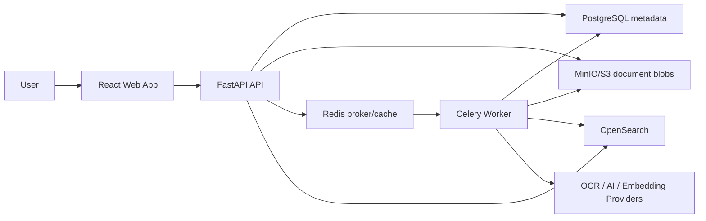
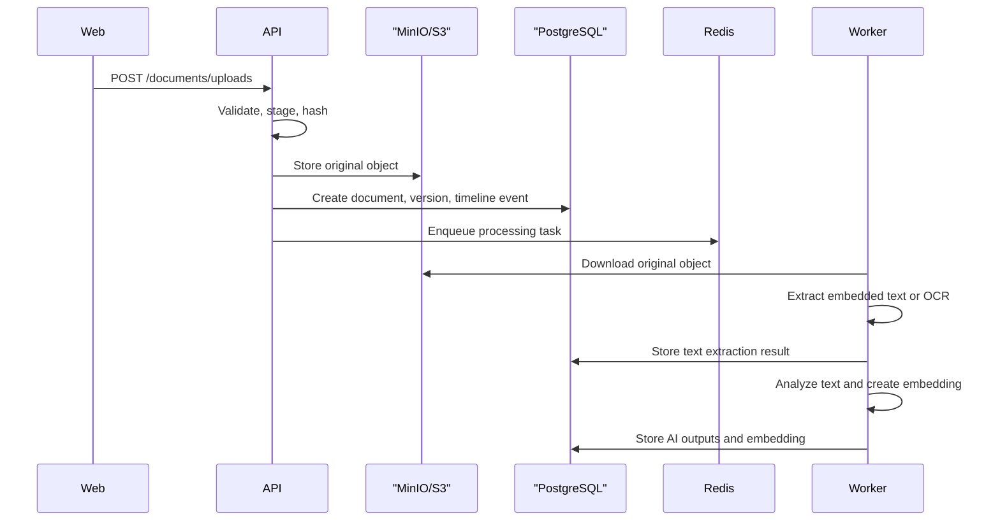

# PaperVault Architecture

## System Context

PaperVault stores personal documents as immutable binary objects and keeps metadata, timelines, tags, extraction results, and user state in PostgreSQL. Searchable text and vector-ready documents are indexed in OpenSearch. Long-running work runs outside the request path through Celery workers.

## Backend Boundaries

The backend follows clean architecture boundaries:

- `api`: HTTP route composition, request/response models, dependency wiring.
- `core`: configuration, logging, observability, cross-cutting runtime concerns.
- `db`: SQLAlchemy engine/session and Alembic integration.
- `worker`: Celery application and task registration.
- Feature packages: `documents`, `timeline`, `tags`, `identity`.
- Future feature packages: `search`, `notifications`, `auth`.

Feature packages should own their use cases, domain models, API schemas, and infrastructure adapters. Cross-feature imports should be deliberate and minimal.

## Persistence Model

Phase 2 adds the core relational schema:

- `users`
- `documents`
- `document_versions`
- `document_metadata`
- `tags`
- `document_tags`
- `timeline_events`

Document files are represented by object-storage bucket/key/version fields. Extracted metadata is stored as versioned JSON records, while searchable indexes and embeddings will be created in later phases.

## Upload and Processing Flow

Phase 3 separates upload from processing:

OCR is an adapter behind the text extraction interface. The default Phase 3 OCR adapter records a clear failure when OCR is not configured.

## AI Processing

Phase 4 adds provider interfaces for AI analysis and embeddings. The default providers are local and deterministic:

- Rule-based document analysis for summary, keywords, entities, suggested tags, category, confidence, and metadata.
- Hashing-based embeddings for a self-hosted baseline.

Provider outputs are stored in PostgreSQL so later phases can index them into OpenSearch for hybrid and semantic search.

## Frontend Boundaries

The frontend is feature-first:

- `app`: application composition, providers, routing.
- `features`: user-facing workflows and feature-specific state.
- `components/ui`: shared primitive components.
- `lib`: small shared utilities and API client code.

## Data Storage

Document files are never stored in PostgreSQL. The database stores metadata and object references. Object storage is responsible for original uploads, extracted page images if needed, and derived artifacts that are too large for relational storage.

## Provider Strategy

OCR, embeddings, LLM summaries, object storage, and search providers will be implemented behind interfaces. The default self-hosted path should work without proprietary services; hosted AI providers can be added as optional adapters.
