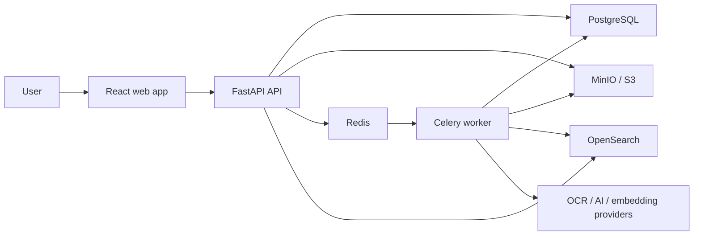
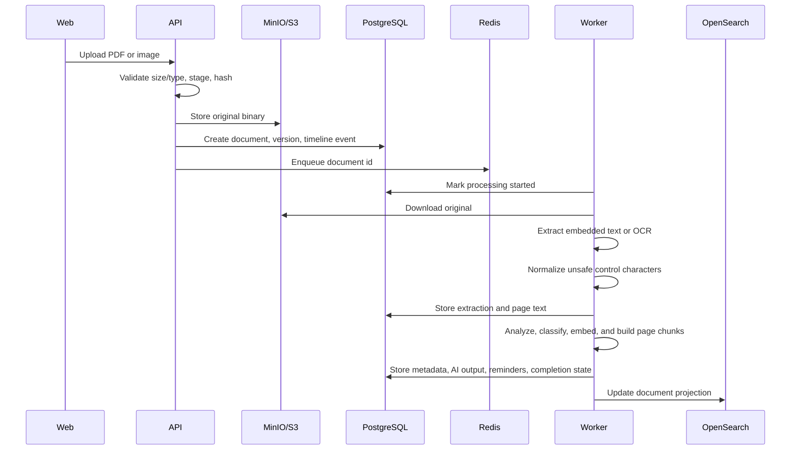

# Architecture

## System Context

PaperVault keeps document binaries in S3-compatible object storage and stores metadata, users, processing state, timelines, tags, notifications, and search history in PostgreSQL. OpenSearch is a rebuildable query projection. Redis transports background jobs to Celery workers.

PostgreSQL and object storage are authoritative. OpenSearch can be rebuilt from those sources and is never the only copy of document metadata or extracted text.

## Code Boundaries

The backend is a modular monolith organized by feature:

- `documents`: uploads, extraction, processing, metadata, versions, viewer data, retry, archive, and duplicate resolution.
- `identity`: local authentication, OIDC, JWTs, RBAC, and user management.
- `administration`: persisted instance policy and runtime administration views.
- `search`: database and OpenSearch query/index adapters plus search history.
- `questions`: tenant-scoped chunk retrieval, grounded answer policy, citations, and refusal behavior.
- `tags`: tag ownership and document assignment.
- `notifications`: reminder projection and user status.
- `timeline`: append-only document activity.
- `core`: configuration, logging, health, and observability.

HTTP routes validate transport data and call application services. Celery tasks compose provider adapters and use cases. Business rules do not belong in route handlers or task functions.

The frontend follows the same feature-first approach:

- `app`: providers and routing.
- `features`: documents, questions, administration, tags, duplicates, notifications, and shell workflows.
- `components/ui`: shared interaction primitives.
- `lib`: typed API client, configuration, and small utilities.

## Upload And Processing

Processing state is committed before expensive work starts. Expected extraction failures and unexpected worker failures end in a visible `failed` state with a user-safe diagnostic. Failed and stale queued documents can be re-enqueued without re-uploading the source file. Archive is terminal and cannot be overwritten by a late worker.

## Extraction And Intelligence

The extraction interface supports embedded PDF text and OCR adapters. The default composite implementation tries embedded text first and uses Poppler plus Tesseract when the PDF has no usable text. Extracted text is normalized at the persistence boundary so provider-specific control characters cannot invalidate a PostgreSQL transaction.

Page text is stored as immutable children of each extraction. Flattened text remains available for summaries, metadata extraction, embeddings, and global search.

AI analysis and embeddings use provider interfaces. The default local providers are deterministic and require no external service. Ollama and OpenAI-compatible adapters implement the same contracts. Model output is parsed as structured JSON, categories are checked against the document-type registry, confidence is bounded, and embedding dimensions are validated before persistence.

High-confidence suggested tags are normalized and attached automatically with an `ai`
source and confidence score. Existing manual tag links take precedence. Classification
and tag changes remain searchable through the eventual OpenSearch projection.

## Grounded Questions

Question answering is separate from document search. Search returns ranked documents; the question service retrieves page-bound chunks from ready documents owned by the caller and asks a grounded-answer provider to answer only from that evidence.

Chunks and their embeddings are materialized during normal AI processing. The question service lazily backfills chunks for older current extractions, which avoids a blocking data migration. The local answer provider is extractive: it selects a bounded evidence excerpt, reports confidence, cites the document and page, and refuses when too few question concepts appear in the evidence. Ollama and OpenAI-compatible answer providers receive only retrieved evidence and must return citation indexes or refuse. The service validates those indexes and preserves the same citation contract for every provider.

The database is the chunk source of truth. Retrieval is currently bounded to 5,000 owned chunks per request; a dedicated OpenSearch chunk projection is the scaling path for larger vaults. A future model-backed answer provider must preserve the same citation and refusal contract.

## Search

The worker projects owned document fields, current text, AI output, metadata, tags, and embeddings into OpenSearch. Keyword, semantic, and hybrid queries use OpenSearch when enabled. A PostgreSQL scorer remains available as a controlled fallback.

Lifecycle and tag changes commit to PostgreSQL first and then refresh the search projection on a best-effort basis. Indexing failure is observable but does not roll back a successful metadata edit.

## Document Lifecycle

- Source binaries are not stored in PostgreSQL.
- Metadata updates create versioned current records rather than overwriting extraction history.
- Archive hides documents from normal lists, duplicate candidates, notifications, and search without deleting source data.
- Permanent deletion is owner-scoped and removes source/version objects, the PostgreSQL document graph, and the rebuildable search projection.
- Exact duplicate resolution archives redundant copies chosen by the user.
- Version records hold immutable storage references; replacement and restore workflows remain planned.
- Timeline events capture uploads, metadata edits, tag changes, archives, and related lifecycle actions.

## Identity And Administration

Local passwords use PBKDF2-SHA256 with per-password salts. JWT access tokens carry issuer, audience, expiry, subject, email, and role claims; each request also checks the current database user state. OIDC uses provider discovery, authorization code exchange, signed callback state, nonce verification, and JWKS-backed ID token validation.

The first account becomes an administrator. Administrators can manage users and override the local-registration policy at runtime. The environment value remains the bootstrap default until a persisted instance setting is saved. Provider names and operational capability flags are visible to administrators, while secrets remain environment or secret-store configuration.

## Viewer And UI

The PDF viewer is loaded only when a preview opens. PDF.js renders one responsive page at a time with zoom, page navigation, a text layer, and highlighted literal matches. OCR-only documents use stored page text for result navigation; precise image overlays require OCR geometry that is not yet persisted.

The application opens on a vault dashboard. A full-width document library remains usable as collections grow, and document review uses a separate detail state rather than competing list, preview, and metadata columns. Secondary editors, raw metadata, filters, and search history appear only when requested. Settings and provider health are visible only to administrators. Light and dark themes share the same semantic design tokens.

## Observability

- Structured application and worker logs.
- Prometheus metrics at `/metrics`.
- OpenTelemetry tracing when an OTLP endpoint is configured.
- Liveness and database-backed readiness endpoints for orchestration.
- User-safe processing diagnostics in PostgreSQL with detailed exceptions retained in worker logs.

Readiness verifies the API database path. Deeper object-storage, Redis, and OpenSearch synthetic checks belong in external monitoring so transient optional-provider failures do not remove every API pod from service.

## Deployment

Docker Compose provides a complete development stack. The Helm chart deploys the stateless application workloads, migration hook, probes, services, and optional Gateway API route. Lab dependencies are suitable for tests and homelabs; long-lived production installations should use managed or operator-owned stateful services with tested backup and restore procedures.
