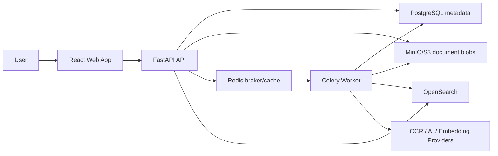
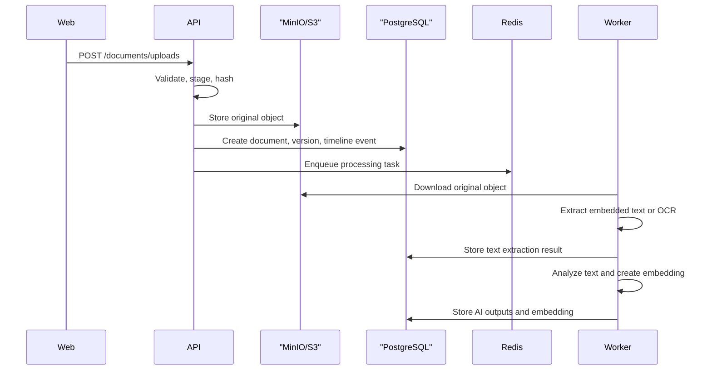

# PaperVault Architecture

## System Context

PaperVault stores personal documents as immutable binary objects and keeps metadata, timelines, tags, extraction results, search history, notifications, and user state in PostgreSQL. Searchable text and vector-ready document projections are indexed in OpenSearch while the API retains a database-backed query fallback. Long-running work runs outside the request path through Celery workers.

## Backend Boundaries

The backend follows clean architecture boundaries:

- `api`: HTTP route composition, request/response models, dependency wiring.
- `core`: configuration, logging, observability, cross-cutting runtime concerns.
- `db`: SQLAlchemy engine/session and Alembic integration.
- `worker`: Celery application and task registration.
- Feature packages: `documents`, `timeline`, `tags`, `identity`, `search`, `notifications`.

Feature packages should own their use cases, domain models, API schemas, and infrastructure adapters. Cross-feature imports should be deliberate and minimal.

## Persistence Model

Phase 2 adds the core relational schema:

- `users`
- `documents`
- `document_versions`
- `document_metadata`
- `tags`
- `document_tags`
- `timeline_events`

Document files are represented by object-storage bucket/key/version fields. Extracted metadata is stored as versioned JSON records, while searchable indexes and embeddings will be created in later phases.

## Upload and Processing Flow

Phase 3 separates upload from processing:

OCR is an adapter behind the text extraction interface. Phase 7 adds a local Tesseract adapter for scanned PDFs and images. PDFs without embedded text are rendered to page images with Poppler before OCR. The unavailable OCR adapter remains available for deployments that intentionally disable OCR.

## Document Lifecycle

Phase 12 adds command-side document lifecycle operations:

- Document fields such as title, type, date, issuer, and organization can be manually edited.
- Structured metadata replacement creates a new current manual metadata record and keeps older records for audit/history.
- Metadata updates derive searchable document fields from common metadata keys such as `vendor`, `provider`, `bank`, `employer`, `purchase_date`, and `expiry_date`.
- Archive marks a document as `archived`, records a timeline event, and removes it from default document listing, duplicate detection, and search results.
- Version history is exposed in document detail from the existing `document_versions` table.

Lifecycle commands update PostgreSQL first and then refresh the OpenSearch projection on a best-effort basis. Search indexing failures are logged but do not reject the user's metadata edit or archive action.

## Tags

Phase 14 makes tags an editable document workflow:

- Users can attach an existing tag, create a new manual tag directly from document detail, detach an assigned tag, or accept an AI-suggested tag.
- Suggested tags are treated as recommendations until the user accepts them. Accepted suggestions create or reuse manual tags and then attach them to the document.
- Tag assignment remains an owner-scoped backend use case that validates document and tag ownership and writes `tags_changed` timeline events.
- Tag attach and detach operations refresh the OpenSearch document projection on a best-effort basis so tag filters remain consistent with PostgreSQL.

## AI Processing

Phase 4 adds provider interfaces for AI analysis and embeddings. The default providers are local and deterministic:

- Rule-based document analysis for summary, keywords, entities, suggested tags, category, confidence, and metadata.
- Hashing-based embeddings for a self-hosted baseline.

Provider outputs are stored in PostgreSQL. Phase 5 used those records for database-backed keyword, semantic, and hybrid search. Phase 10 keeps the database scorer as a fallback while moving the primary query path to OpenSearch when indexing is enabled.

## Search Indexing

Phase 8 adds OpenSearch indexing behind a provider boundary, and Phase 10 adds user-facing query execution:

- The worker projects document metadata, current text extraction, current AI analysis, tags, metadata, and embeddings into a search document.
- The OpenSearch adapter creates `papervault-documents-v1` with keyword, text, object, date, and `knn_vector` fields.
- Indexing failures are logged and do not mark document processing as failed.
- `/search/index/documents/{document_id}` and `/search/index/rebuild` allow owner-scoped reindexing.
- `POST /search` uses OpenSearch for keyword, semantic, and hybrid queries when `PAPERVAULT_SEARCH_QUERY_BACKEND=opensearch` and indexing is enabled.
- PostgreSQL remains the source of truth and the fallback query path when OpenSearch is unavailable or explicitly disabled.
- Document lifecycle and tag mutations refresh an affected document's projection after the database transaction succeeds.
- Phase 13 exposes advanced filters in the web app for document type, tag, issuer, organization, date range, and archived inclusion.
- Saved and recent searches reuse the same typed search request shape, so applying a saved or recent search goes through the same query path as a manual search.

## Identity and Access

Phase 6 adds local authentication without moving auth logic into route handlers, and Phase 11
adds OIDC authorization-code login:

- Local account registration and login are handled by the identity application service.
- Password hashes use PBKDF2-SHA256 with per-password salts and configurable iterations.
- Bearer tokens are signed JWTs with issuer, audience, expiry, user id, email, and role claims.
- `get_current_user` validates bearer tokens first and falls back to development headers only outside production when explicitly enabled.
- RBAC is exposed through reusable dependencies such as admin-only user management.
- OIDC discovery, authorization URL generation, token exchange, and JWKS-backed ID token verification live behind an infrastructure adapter.
- OIDC callback state is signed with `JWT_SIGNING_KEY` and includes a nonce, expiry, and same-origin post-login redirect path.
- OIDC users are created by provider subject. Existing local accounts are not automatically linked by email.

## Frontend Boundaries

The frontend is feature-first:

- `app`: application composition, providers, routing.
- `features`: user-facing workflows and feature-specific state.
- `components/ui`: shared primitive components.
- `lib`: small shared utilities and API client code.

Phase 15 improves the production workspace shell without changing API contracts:

- The document workspace uses three explicit regions: vault navigation, search/list, and document review.
- Empty states are actionable workflow surfaces with upload and search recovery actions instead of plain text placeholders.
- Search keeps the primary query path visible while advanced filters are grouped behind an expandable panel.
- Document review separates preview, document identity, operational metrics, metadata editing, tags, timeline, and versions into a consistent sidebar.
- Shared styling remains small: design tokens, the button primitive, and local shell presentation components. A larger design-system extraction is deferred until repeated UI patterns justify it.

## Data Storage

Document files are never stored in PostgreSQL. The database stores metadata and object references. Object storage is responsible for original uploads, extracted page images if needed, and derived artifacts that are too large for relational storage.

## Provider Strategy

OCR, embeddings, LLM summaries, object storage, and search providers are implemented behind interfaces. The default self-hosted path works without proprietary services; hosted AI providers and remote OCR providers can be added as optional adapters.

## Deployment Model

Phase 9 adds a Kubernetes deployment boundary, and Phase 10 hardens deployment verification:

- GitHub Actions builds API, worker, and web images and pushes them to GHCR.
- The Helm chart deploys API, worker, web, services, config, secrets, an Alembic migration job, and a Helm smoke test.
- PostgreSQL, Redis, S3-compatible object storage, and OpenSearch remain external production services.
- Runtime secrets can be chart-managed for local labs or supplied through an existing Kubernetes Secret for production.
- The lab profile can optionally deploy PostgreSQL, Redis, MinIO, and OpenSearch for smoke testing.
- API and worker pods run with non-root, restricted-style security contexts. The web image now listens on port 8080 so it can run as non-root.
